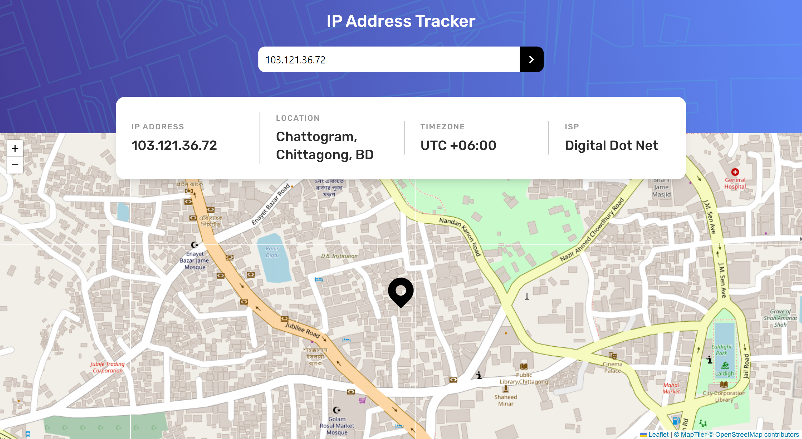
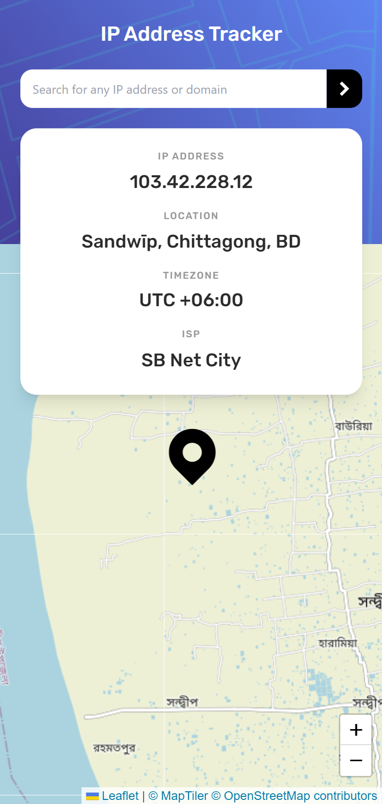

# Frontend Mentor - IP address tracker solution

This is a solution to the [IP address tracker challenge on Frontend Mentor](https://www.frontendmentor.io/challenges/ip-address-tracker-I8-0yYAH0). Frontend Mentor challenges help you improve your coding skills by building realistic projects. 

## Table of contents

- [Overview](#overview)
  - [The challenge](#the-challenge)
  - [Screenshot](#screenshot)
  - [Links](#links)
- [My process](#my-process)
  - [Built with](#built-with)
  - [Resources](#resources)

## Overview

### The challenge

Users should be able to:

- View the optimal layout for each page depending on their device's screen size
- See hover states for all interactive elements on the page
- See their own IP address on the map on the initial page load
- Search for any IP addresses or domains and see the key information and location

### Screenshot

- Desktop

- Mobile 

### Links

- Solution URL: [My Solution](https://github.com/khalidmahamud/ip-address-tracker-master)
- Live Site URL: [Live site URL here](https://ip-address-tracker-master1.netlify.app/)

## My process

### Built with

- Semantic HTML5 markup
- Flexbox
- Mobile-first workflow
- Tailwind CSS

### Resources

- [Leaflet](https://leafletjs.com/index.html) - An open-source JavaScript library
for mobile-friendly interactive maps
- [IP Geolocation API](https://geo.ipify.org/) - Our real-time IP Geolocation API lets you look up IP locations accurately.

